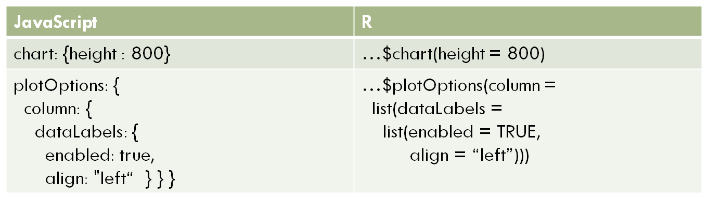

## A little about rCharts

* rCharts is an R package to create, customize and publish interactive JavaScript visualizations from R 
* Developed by Ramnath Vaidyanathan, creator of Slidify
* uses a familiar lattice style plotting interface.
* R code is converted to JavaScript on the back end, see it when you type 

```
mychart$print()
```

* rCharts by itself is interactive to a point, but within a Shiny app it allows input and modification of data in the chart
* Installation: 

```
require(devtools) 
install_github('rCharts', 'ramnathv') 
```
---

## Working with rCharts

Load the library, prepare data, create plot as is or assign it to a variable.

 

---
## Interactive Chart

<div id = 'chart1' class = 'rChart highcharts'></div>
<script type='text/javascript'>
    (function($){
        $(function () {
            var chart = new Highcharts.Chart({
 "dom": "chart1",
"width":            800,
"height":            400,
"credits": {
 "href": null,
"text": null 
},
"exporting": {
 "enabled": false 
},
"title": {
 "text": null 
},
"yAxis": [
 {
 "title": {
 "text": "Freq" 
} 
} 
],
"series": [
 {
 "data": [
 [
 "Black",
            11 
],
[
 "Brown",
            50 
],
[
 "Red",
            10 
],
[
 "Blond",
            30 
] 
],
"name": "Blue",
"type": "column",
"marker": {
 "radius":              3 
} 
},
{
 "data": [
 [
 "Black",
            32 
],
[
 "Brown",
            53 
],
[
 "Red",
            10 
],
[
 "Blond",
             3 
] 
],
"name": "Brown",
"type": "column",
"marker": {
 "radius":              3 
} 
},
{
 "data": [
 [
 "Black",
             3 
],
[
 "Brown",
            15 
],
[
 "Red",
             7 
],
[
 "Blond",
             8 
] 
],
"name": "Green",
"type": "column",
"marker": {
 "radius":              3 
} 
},
{
 "data": [
 [
 "Black",
            10 
],
[
 "Brown",
            25 
],
[
 "Red",
             7 
],
[
 "Blond",
             5 
] 
],
"name": "Hazel",
"type": "column",
"marker": {
 "radius":              3 
} 
} 
],
"xAxis": [
 {
 "title": {
 "text": "Hair" 
},
"categories": [ "Black", "Brown", "Red", "Blond" ] 
} 
],
"subtitle": {
 "text": null 
},
"chart": {
 "height":            400,
"renderTo": "chart1" 
},
"id": "chart1" 
});
        });
    })(jQuery);
</script>

```
library(rCharts)
haireye = as.data.frame(HairEyeColor)
n1 <- hPlot(Freq ~ Hair, group = 'Eye', type = 'column',
  data = subset(haireye, Sex == 'Male'))
n1
```

---
## Popular rCharts libraries:

* Polychart (rPlot() function for basic, but powerful charts, inspired by ggplot2)
* Morris (mPlot() function for pretty time-series line graphs)
* NVD3 (nPlot() function based on d3js library for amazing interactive visualizations with little code and customization)
* xCharts (xPlot() function for slick looking charts using d3js, made by TenXer)
* HighCharts (hPlot() function interactive charts, time series graphs and map charts)
* Leaflet (Leaflet$new() function for mobile-friendly interactive maps)
* Rickshaw (Rickshaw$new() function for creating interactive time series graphs, developed at Shutterstock)

---

## Example 1


<div id = 'chart2' class = 'rChart highcharts'></div>
<script type='text/javascript'>
    (function($){
        $(function () {
            var chart = new Highcharts.Chart({
 "dom": "chart2",
"width":            800,
"height":            400,
"credits": {
 "href": null,
"text": null 
},
"exporting": {
 "enabled": false 
},
"title": {
 "text": null 
},
"yAxis": [
 {
 "title": {
 "text": "SepalWidth" 
} 
} 
],
"series": [
 {
 "data": [
 [
            4.3,
             3,
           0.1 
],
[
            4.4,
           2.9,
           0.2 
],
[
            4.4,
             3,
           0.2 
],
[
            4.4,
           3.2,
           0.2 
],
[
            4.5,
           2.3,
           0.3 
],
[
            4.6,
           3.1,
           0.2 
],
[
            4.6,
           3.2,
           0.2 
],
[
            4.6,
           3.4,
           0.3 
],
[
            4.6,
           3.6,
           0.2 
],
[
            4.7,
           3.2,
           0.2 
],
[
            4.7,
           3.2,
           0.2 
],
[
            4.8,
             3,
           0.1 
],
[
            4.8,
             3,
           0.3 
],
[
            4.8,
           3.1,
           0.2 
],
[
            4.8,
           3.4,
           0.2 
],
[
            4.8,
           3.4,
           0.2 
],
[
            4.9,
             3,
           0.2 
],
[
            4.9,
           3.1,
           0.1 
],
[
            4.9,
           3.1,
           0.2 
],
[
            4.9,
           3.6,
           0.1 
],
[
              5,
             3,
           0.2 
],
[
              5,
           3.2,
           0.2 
],
[
              5,
           3.3,
           0.2 
],
[
              5,
           3.4,
           0.2 
],
[
              5,
           3.4,
           0.4 
],
[
              5,
           3.5,
           0.3 
],
[
              5,
           3.5,
           0.6 
],
[
              5,
           3.6,
           0.2 
],
[
            5.1,
           3.3,
           0.5 
],
[
            5.1,
           3.4,
           0.2 
],
[
            5.1,
           3.5,
           0.2 
],
[
            5.1,
           3.5,
           0.3 
],
[
            5.1,
           3.7,
           0.4 
],
[
            5.1,
           3.8,
           0.3 
],
[
            5.1,
           3.8,
           0.4 
],
[
            5.1,
           3.8,
           0.2 
],
[
            5.2,
           3.4,
           0.2 
],
[
            5.2,
           3.5,
           0.2 
],
[
            5.2,
           4.1,
           0.1 
],
[
            5.3,
           3.7,
           0.2 
],
[
            5.4,
           3.4,
           0.2 
],
[
            5.4,
           3.4,
           0.4 
],
[
            5.4,
           3.7,
           0.2 
],
[
            5.4,
           3.9,
           0.4 
],
[
            5.4,
           3.9,
           0.4 
],
[
            5.5,
           3.5,
           0.2 
],
[
            5.5,
           4.2,
           0.2 
],
[
            5.7,
           3.8,
           0.3 
],
[
            5.7,
           4.4,
           0.4 
],
[
            5.8,
             4,
           0.2 
] 
],
"name": "setosa",
"type": "bubble",
"marker": {
 "radius":              3 
} 
},
{
 "data": [
 [
            4.9,
           2.4,
             1 
],
[
              5,
             2,
             1 
],
[
              5,
           2.3,
             1 
],
[
            5.1,
           2.5,
           1.1 
],
[
            5.2,
           2.7,
           1.4 
],
[
            5.4,
             3,
           1.5 
],
[
            5.5,
           2.3,
           1.3 
],
[
            5.5,
           2.4,
           1.1 
],
[
            5.5,
           2.4,
             1 
],
[
            5.5,
           2.5,
           1.3 
],
[
            5.5,
           2.6,
           1.2 
],
[
            5.6,
           2.5,
           1.1 
],
[
            5.6,
           2.7,
           1.3 
],
[
            5.6,
           2.9,
           1.3 
],
[
            5.6,
             3,
           1.5 
],
[
            5.6,
             3,
           1.3 
],
[
            5.7,
           2.6,
             1 
],
[
            5.7,
           2.8,
           1.3 
],
[
            5.7,
           2.8,
           1.3 
],
[
            5.7,
           2.9,
           1.3 
],
[
            5.7,
             3,
           1.2 
],
[
            5.8,
           2.6,
           1.2 
],
[
            5.8,
           2.7,
             1 
],
[
            5.8,
           2.7,
           1.2 
],
[
            5.9,
             3,
           1.5 
],
[
            5.9,
           3.2,
           1.8 
],
[
              6,
           2.2,
             1 
],
[
              6,
           2.7,
           1.6 
],
[
              6,
           2.9,
           1.5 
],
[
              6,
           3.4,
           1.6 
],
[
            6.1,
           2.8,
           1.3 
],
[
            6.1,
           2.8,
           1.2 
],
[
            6.1,
           2.9,
           1.4 
],
[
            6.1,
             3,
           1.4 
],
[
            6.2,
           2.2,
           1.5 
],
[
            6.2,
           2.9,
           1.3 
],
[
            6.3,
           2.3,
           1.3 
],
[
            6.3,
           2.5,
           1.5 
],
[
            6.3,
           3.3,
           1.6 
],
[
            6.4,
           2.9,
           1.3 
],
[
            6.4,
           3.2,
           1.5 
],
[
            6.5,
           2.8,
           1.5 
],
[
            6.6,
           2.9,
           1.3 
],
[
            6.6,
             3,
           1.4 
],
[
            6.7,
             3,
           1.7 
],
[
            6.7,
           3.1,
           1.4 
],
[
            6.7,
           3.1,
           1.5 
],
[
            6.8,
           2.8,
           1.4 
],
[
            6.9,
           3.1,
           1.5 
],
[
              7,
           3.2,
           1.4 
] 
],
"name": "versicolor",
"type": "bubble",
"marker": {
 "radius":              3 
} 
},
{
 "data": [
 [
            4.9,
           2.5,
           1.7 
],
[
            5.6,
           2.8,
             2 
],
[
            5.7,
           2.5,
             2 
],
[
            5.8,
           2.7,
           1.9 
],
[
            5.8,
           2.7,
           1.9 
],
[
            5.8,
           2.8,
           2.4 
],
[
            5.9,
             3,
           1.8 
],
[
              6,
           2.2,
           1.5 
],
[
              6,
             3,
           1.8 
],
[
            6.1,
           2.6,
           1.4 
],
[
            6.1,
             3,
           1.8 
],
[
            6.2,
           2.8,
           1.8 
],
[
            6.2,
           3.4,
           2.3 
],
[
            6.3,
           2.5,
           1.9 
],
[
            6.3,
           2.7,
           1.8 
],
[
            6.3,
           2.8,
           1.5 
],
[
            6.3,
           2.9,
           1.8 
],
[
            6.3,
           3.3,
           2.5 
],
[
            6.3,
           3.4,
           2.4 
],
[
            6.4,
           2.7,
           1.9 
],
[
            6.4,
           2.8,
           2.1 
],
[
            6.4,
           2.8,
           2.2 
],
[
            6.4,
           3.1,
           1.8 
],
[
            6.4,
           3.2,
           2.3 
],
[
            6.5,
             3,
           2.2 
],
[
            6.5,
             3,
           1.8 
],
[
            6.5,
             3,
             2 
],
[
            6.5,
           3.2,
             2 
],
[
            6.7,
           2.5,
           1.8 
],
[
            6.7,
             3,
           2.3 
],
[
            6.7,
           3.1,
           2.4 
],
[
            6.7,
           3.3,
           2.1 
],
[
            6.7,
           3.3,
           2.5 
],
[
            6.8,
             3,
           2.1 
],
[
            6.8,
           3.2,
           2.3 
],
[
            6.9,
           3.1,
           2.1 
],
[
            6.9,
           3.1,
           2.3 
],
[
            6.9,
           3.2,
           2.3 
],
[
            7.1,
             3,
           2.1 
],
[
            7.2,
             3,
           1.6 
],
[
            7.2,
           3.2,
           1.8 
],
[
            7.2,
           3.6,
           2.5 
],
[
            7.3,
           2.9,
           1.8 
],
[
            7.4,
           2.8,
           1.9 
],
[
            7.6,
             3,
           2.1 
],
[
            7.7,
           2.6,
           2.3 
],
[
            7.7,
           2.8,
             2 
],
[
            7.7,
             3,
           2.3 
],
[
            7.7,
           3.8,
           2.2 
],
[
            7.9,
           3.8,
             2 
] 
],
"name": "virginica",
"type": "bubble",
"marker": {
 "radius":              3 
} 
} 
],
"xAxis": [
 {
 "title": {
 "text": "SepalLength" 
} 
} 
],
"subtitle": {
 "text": null 
},
"chart": {
 "height":            400,
"renderTo": "chart2" 
},
"id": "chart2" 
});
        });
    })(jQuery);
</script>

```
names(iris) = gsub("\\.", "", names(iris))
plot1 <- hPlot(x="SepalLength", y="SepalWidth", type="bubble", group ="Species",
size = PetalWidth, data=iris)
plot1
```


---

## Example 2
(courtesy of http://ramnathv.github.io/rCharts/)
Try this in RStudio
```
library(rCharts)
usp = reshape2::melt(USPersonalExpenditure)
# get the decades into a date Rickshaw likes
usp$Var2 <- as.numeric(as.POSIXct(paste0(usp$Var2, "-01-01")))
p4 <- Rickshaw$new()
p4$layer(value ~ Var2, group = "Var1", data = usp, type = "area", width = 560)
# add a helpful slider 
p4$set(slider = TRUE)
p4$
```

See it live here: http://rcharts.io/viewer/?10aed0d9466518e9c265#.U9AWhbH-L1U

---

## Example 3 
 


<div id = 'chart3' class = 'rChart nvd3'></div>
<script type='text/javascript'>
 $(document).ready(function(){
      drawchart3()
    });
    function drawchart3(){  
      var opts = {
 "dom": "chart3",
"width":    800,
"height":    400,
"x": "State",
"y": "value",
"group": "variable",
"type": "multiBarChart",
"id": "chart3" 
},
        data = [
 {
 "State": "CALIFORNIA",
"UFOReports": 10639,
"variable": "AirForce",
"value": 7 
},
{
 "State": "MISSOURI",
"UFOReports": 1772,
"variable": "AirForce",
"value": 1 
},
{
 "State": "NEW YORK",
"UFOReports": 3580,
"variable": "AirForce",
"value": null 
},
{
 "State": "TEXAS",
"UFOReports": 4106,
"variable": "AirForce",
"value": 8 
},
{
 "State": "CALIFORNIA",
"UFOReports": 10639,
"variable": "Army",
"value": 5 
},
{
 "State": "MISSOURI",
"UFOReports": 1772,
"variable": "Army",
"value": 1 
},
{
 "State": "NEW YORK",
"UFOReports": 3580,
"variable": "Army",
"value": 5 
},
{
 "State": "TEXAS",
"UFOReports": 4106,
"variable": "Army",
"value": 3 
},
{
 "State": "CALIFORNIA",
"UFOReports": 10639,
"variable": "CoastGuard",
"value": 2 
},
{
 "State": "MISSOURI",
"UFOReports": 1772,
"variable": "CoastGuard",
"value": null 
},
{
 "State": "NEW YORK",
"UFOReports": 3580,
"variable": "CoastGuard",
"value": null 
},
{
 "State": "TEXAS",
"UFOReports": 4106,
"variable": "CoastGuard",
"value": null 
},
{
 "State": "CALIFORNIA",
"UFOReports": 10639,
"variable": "MarineCorps",
"value": 5 
},
{
 "State": "MISSOURI",
"UFOReports": 1772,
"variable": "MarineCorps",
"value": null 
},
{
 "State": "NEW YORK",
"UFOReports": 3580,
"variable": "MarineCorps",
"value": null 
},
{
 "State": "TEXAS",
"UFOReports": 4106,
"variable": "MarineCorps",
"value": null 
},
{
 "State": "CALIFORNIA",
"UFOReports": 10639,
"variable": "Navy",
"value": 13 
},
{
 "State": "MISSOURI",
"UFOReports": 1772,
"variable": "Navy",
"value": null 
},
{
 "State": "NEW YORK",
"UFOReports": 3580,
"variable": "Navy",
"value": 1 
},
{
 "State": "TEXAS",
"UFOReports": 4106,
"variable": "Navy",
"value": 4 
},
{
 "State": "CALIFORNIA",
"UFOReports": 10639,
"variable": "Total",
"value": 32 
},
{
 "State": "MISSOURI",
"UFOReports": 1772,
"variable": "Total",
"value": 2 
},
{
 "State": "NEW YORK",
"UFOReports": 3580,
"variable": "Total",
"value": 6 
},
{
 "State": "TEXAS",
"UFOReports": 4106,
"variable": "Total",
"value": 15 
} 
]
  
      if(!(opts.type==="pieChart" || opts.type==="sparklinePlus" || opts.type==="bulletChart")) {
        var data = d3.nest()
          .key(function(d){
            //return opts.group === undefined ? 'main' : d[opts.group]
            //instead of main would think a better default is opts.x
            return opts.group === undefined ? opts.y : d[opts.group];
          })
          .entries(data);
      }
      
      if (opts.disabled != undefined){
        data.map(function(d, i){
          d.disabled = opts.disabled[i]
        })
      }
      
      nv.addGraph(function() {
        var chart = nv.models[opts.type]()
          .width(opts.width)
          .height(opts.height)
          
        if (opts.type != "bulletChart"){
          chart
            .x(function(d) { return d[opts.x] })
            .y(function(d) { return d[opts.y] })
        }
          
         
        
          
        

        
        
        
      
       d3.select("#" + opts.id)
        .append('svg')
        .datum(data)
        .transition().duration(500)
        .call(chart);

       nv.utils.windowResize(chart.update);
       return chart;
      });
    };
</script>

---


## Code for Example 3

```
ufo <- subset(mergeddata, State == "CALIFORNIA"| State == "TEXAS"| 
State == "NEW YORK" | State == "MISSOURI")
ufo1 <- melt(ufo, id=c("State", "UFOReports"), na.rm = FALSE)
ufoplot <- nPlot(value ~ State, group = "variable", data = ufo1, 
type = "multiBarChart")
ufoplot
```

---


## Example 4


<div id = 'chart4' class = 'rChart highcharts'></div>
<script type='text/javascript'>
    (function($){
        $(function () {
            var chart = new Highcharts.Chart({
 "dom": "chart4",
"width":            800,
"height":            400,
"credits": {
 "href": null,
"text": null 
},
"exporting": {
 "enabled": false 
},
"title": {
 "text": "UFO Reports and Total number of Military Bases by State" 
},
"yAxis": [
 {
 "title": {
 "text": "UFOReports" 
} 
} 
],
"series": [
 {
 "data": [
 [
 1,
203,
1 
],
[
 1,
226,
1 
],
[
 1,
231,
1 
],
[
 1,
452,
1 
],
[
 1,
553,
1 
],
[
 1,
588,
1 
],
[
 1,
627,
1 
],
[
 1,
2724,
1 
],
[
 2,
153,
2 
],
[
 2,
812,
1 
],
[
 2,
1014,
1 
],
[
 2,
1772,
1 
],
[
 2,
2306,
1 
],
[
 3,
719,
1 
],
[
 3,
742,
1 
],
[
 3,
1500,
1 
],
[
 4,
927,
3 
],
[
 4,
2921,
1 
],
[
 5,
400,
2 
],
[
 5,
669,
1 
],
[
 5,
857,
3 
],
[
 6,
470,
2 
],
[
 6,
1667,
1 
],
[
 6,
1689,
5 
],
[
 6,
2994,
2 
],
[
 7,
118,
1 
],
[
 7,
789,
2 
],
[
 7,
2093,
2 
],
[
 8,
999,
1 
],
[
 8,
1254,
2 
],
[
 8,
4730,
2 
],
[
 10,
398,
1 
],
[
 12,
1526,
2 
],
[
 15,
4106,
8 
],
[
 17,
4711,
5 
],
[
 20,
1544,
1 
],
[
 32,
10639,
7 
] 
],
"type": "bubble",
"marker": {
 "radius":              3 
} 
} 
],
"legend": {
 "enabled": false 
},
"xAxis": [
 {
 "title": {
 "text": "Total Number of Military Bases in State" 
} 
} 
],
"subtitle": {
 "text": "Size of bubble - number of AirForce Bases" 
},
"chart": {
 "zoomType": "xy",
"renderTo": "chart4" 
},
"tooltip": {
 "formatter":  function() { return 'All Miliary Bases: '     + this.point.x + '<br />' + 'UFO Reports: '    + this.point.y  + '<br />'; }  
},
"id": "chart4" 
});
        });
    })(jQuery);
</script>

---


## Code for Example 4

```
ufoplot <- hPlot(x="Total", y = "UFOReports", data = mergeddata, type = "bubble",
title = "UFO Reports and Total number of Military Bases by State",  
subtitle = "Size of bubble - number of AirForce Bases", 
size = "AirForce")
ufoplot$chart(zoomType = "xy") # will allow to draw a rectangle with mouse to zoom on an area
ufoplot$tooltip( formatter = "#! function() { return 'All Miliary Bases: ' + 
this.point.x + '<br />' + 'UFO Reports: ' + this.point.y  + '<br />'; } !#")
ufoplot$xAxis(title = list(text = "Total Number of Military Bases in State"))
ufoplot
```

---


## Exercise 1

1. Load rCharts (first install it if you haven't yet)
3. Transform the ChickWeight dataset (base R) so that Time variable is "fuzzy": 
ChickWeight$Time <- ChickWeight$Time + runif(length(ChickWeight$Time), 0, 1)
4. Using Highcharts library build a "scatter" plot to show the growth pattern of chickens: weight over Time, depending on their diet type (group it by Diet), and use a relevant title, for example "Chicken Weight over Time"
5. Rename the y-axis and x-axis default values to be descriptive and consistent
6. Change the width of the chart to be 700px and height - 450px
7. Call your plot, so that it gets displayed, below is a sample

```
ufoplot <- hPlot(x="Total", y = "UFOReports", data = mergeddata, type = "scatter", 
title = "UFO Reports and Total number of Military Bases")
ufoplot$chart(width = 450) 
ufoplot$xAxis(title = list(text = "Total Number of Military Bases in State"))
ufoplot
```

---

## Publishing rCharts

Ways to share:
* Standalone html page (publish to gist.github.com or rpubs.com), the link is returned. Can be updated. Gist allows several files to be uploaded.
* Within Shiny Application (functions renderChart & showOutput)
* Embed into rmd doc, using knit2html, or into a blog post using slidify
* To publish on gist, use your GitHub acount username and password at the prompt after this command executes:
```ufoplot$publish('UFO Reports', host = 'gist')```
* To publish on RPubs, use your account info and tweak RProfile if necessary (see here: http://rpubs.com/conniez/ufo_rchart):
```ufoplot$publish('UFO Reports', host = 'rpubs')```
* Some commands for working with Shiny and Shinyapps.io
```
runApp("myapp")
library(shinyapps)
deployApp("myapp")
```

---


## On Gist


---

## On rPubs
First it opens a confirmation dialog. Here's the result


---

## rCharts + Shiny

You can host your apps in the cloud for free with ShinyApps.io. Just create an account and link to your computer. There are some performance and memory limitations.

---


## Example with rCharts (Exercise 2)

```
# ui.R
library(rCharts)
shinyUI(fluidPage(
  h2("rCharts Example"),
  showOutput("myChart", "highcharts")))
```

```
# server.R
library(rCharts)
shinyServer(function(input, output) {
  output$myChart <- renderChart({
    ChickWeight$Time <- ChickWeight$Time + runif(length(ChickWeight$Time), 0, 1)
    chickPlot <- hPlot(weight ~ Time, type="scatter", group = "Diet", data=ChickWeight, title = "Chicken Weight over Time")
    chickPlot$xAxis(title = list(text = "Time (Days)"))
    chickPlot$yAxis(title = list(text = "Weight"))
    chickPlot$chart(width = 600, height = 450)
    chickPlot$addParams(dom = "myChart")
    return(chickPlot)    
  })})
```
---

## ShinyGridster

* developed by Winston Chang (winston@rstudio.com)
* find source files here: https://github.com/wch/shiny-gridster
* usage: within "fluidPage()" or other layout function in Shiny, specify gridster block dimensions, call each block with its size and position. Margin sizes are optional. Example:
```
shinyUI(bootstrapPage(
  gridster(width = 200, height = 200, marginx = 16, marginy = 16,
    gridsterItem(col = 1, row = 1, sizex = 1, sizey = 1,
      sliderInput("n", "Input value:", min = 0, max = 50, value = 10)
    ),
    gridsterItem(col = 2, row = 1, sizex = 1, sizey = 1,
      textOutput("myText")
    ),
    gridsterItem(col = 1, row = 2, sizex = 2, sizey = 1,
      plotOutput("myPlot", height = 200)
)))
```

---

## Exercise 3

0. Make the chart in your shiny app from exe 2 smaller: 390x320
1. Add the grister function to the ui.R file in your shiny app, within the fluidPage() function. To look up an example, type:
```
library(shinyGridster)
?gridster
```
2. Specify gridster width of 400 and height of 330.
3. Create 3 gridsterItem's: 2 for 1st row and 1 for second row.
4. Your chart should be in the top left element, add the following in the second on top element: create another output element in server.R, similar to mychart, but using renderTable({}) function and put this inside:
```
aggregate(weight ~ feed, data = chickwts, mean)
```
Call this in your ui.R gridsterItem using tableOutput() function and passing it the name of your output from server.R

3. Remove the h2() text element; add your own conclusion using p() function in the lower element. 

---

## Customizing Gridster

sizey and sizex can help create irregular grids (elements of different dimensions)

---


## Why Dashboards in R are Possible

* R allows connecting to any database
* invalidateLater(), reactivePoll() functions in Shiny app
* Any graphical packages can be used for charts
* Control layout with ShinyGridster
* Stylesheets supported (unlimited customization)

---

## Things to Remember(rCharts)

* In a shiny app use function: showOutput("myChart", "polychart"), where you specify the name of the output object and the name of the library in lowercase. 
* Don't forget plot$addParams() and return() in the output element used to create rCharts in server.R file
* If you can't see your chart in Viewer of Rstudio, try opening it in browser by clicking the Open in Browser button.
* Sometimes, if a chart doesn't show up in a Shiny app with several rCharts, you may have to use this "wrapping" trick:

```
div(class='wrapper', tags$style(".highcharts{ height: 100%; width: 800px;}"),
showOutput("infChart", "highcharts"))
```

---

## rCharts API

A lot of the "properties" of the plot object can be customized. All you need to do is get access to the documentation of the rChart library or the original JavaScript library.

To demonstrate the depth of possible customization, we will use an example Highcharts JavaScript library, using their Reference page: http://api.highcharts.com/

---

## Highcharts API Example

Below are the casual "rules" of conversion for HighCharts.

* the elements of a chart are in an object in JS, that gets converted into a list in R; the main object properties will look like this, e.g. `mychart$chart()` or `mychart$plotOptions()`
* these main properties have nested properties, and if the property you customize doesn't have more nested properties (chart: {height: 800}), then use "=" to simply assign that value to a parameter in R, e.g. `mychart$chart(height = 800)`
* if the properties you're attemting to customize has any "nested" properties - use "=" to assign a list() inside of which you will put what is "nested", e.g.

  `mychart$plotOptions(column = (dataLabels = list(enabled=TRUE)))`

---

## Highcharts API (Cont.)

The following demonstration will make these "rules" much clearer.



---

## Example of Customization
The following example just scratches the surface of all the things you can do in rCharts.

<script type='text/javascript' src=//code.jquery.com/jquery-1.9.1.min.js></script>
<script type='text/javascript' src=//code.highcharts.com/highcharts.js></script>
<script type='text/javascript' src=//code.highcharts.com/highcharts-more.js"></script>
<script type='text/javascript' src=//code.highcharts.com/modules/exporting.js></script> 
 <style>
  .rChart {
    display: block;
    margin-left: auto; 
    margin-right: auto;
    width: 800px;
    height: 400px;
  }  
  </style>
<div id = 'chart1528347d7675' class = 'rChart highcharts'></div>
<script type='text/javascript'>
    (function($){
        $(function () {
            var chart = new Highcharts.Chart({
 "dom": "chart1528347d7675",
"width":            800,
"height":            400,
"credits": {
 "href": null,
"text": null 
},
"exporting": {
 "enabled": false 
},
"title": {
 "text": "Quantity of Fruits Collected by Children" 
},
"yAxis": [
 {
 "title": {
 "text": "Quantity of Fruits" 
},
"tickInterval":              2 
} 
],
"series": [
 {
 "data": [
 [
 "Alice",
            15 
],
[
 "Andy",
            20 
],
[
 "John",
            23 
],
[
 "Sam",
            10 
] 
],
"name": "Apples",
"type": "column",
"marker": {
 "radius":              3 
} 
},
{
 "data": [
 [
 "Alice",
             4 
],
[
 "Andy",
            10 
],
[
 "John",
             5 
],
[
 "Sam",
             8 
] 
],
"name": "Oranges",
"type": "column",
"marker": {
 "radius":              3 
} 
} 
],
"xAxis": [
 {
 "title": {
 "text": "Name of Child" 
},
"type": "category",
"labels": {
 "rotation":             60,
"align": "left" 
} 
} 
],
"subtitle": {
 "text": null 
},
"chart": {
 "height":            500,
"zoomType": "xy",
"renderTo": "chart1528347d7675" 
},
"colors": [ "#339900", "#FF9900" ],
"plotOptions": {
 "column": {
 "stacking": "normal",
"dataLabels": {
 "enabled": true,
"align": "center",
"verticalAlign": "top",
"color": "#FFFFFF",
"y":             10 
} 
} 
},
"legend": {
 "align": "center",
"verticalAlign": "top",
"y":             30,
"margin":             20 
},
"id": "chart1528347d7675" 
});
        });
    })(jQuery);
</script>


---


## Code for the Demo

```
fruits<-data.frame(name = c("John", "Alice", "Andy", "Sam", "John", "Alice", "Andy", "Sam"), 
quant = c(23, 15, 20, 10, 5, 4, 10, 8), 
fruit = c(rep("Apples", 4), rep("Oranges", 4)))

samplePlot<- hPlot(quant ~ name, data = fruits, group = "fruit", type = 'column', 
                   title = "Quantity of Fruits Collected by Children")
samplePlot$xAxis(title = list(text="Name of Child"), type = "category", labels = list
                 (rotation = 60, align = "left"))
samplePlot$chart(height = 500, zoomType = "xy")
samplePlot$colors("#339900", "#FF9900")
samplePlot$plotOptions(column = list(stacking = "normal", dataLabels = list(enabled = T, 
                              align = 'center', verticalAlign = "top", 
                              color = '#FFFFFF', y = 10)))
samplePlot$yAxis(title = list(text = "Quantity of Fruits"), tickInterval = 2)
samplePlot$legend(align = 'center', verticalAlign = 'top', y = 30, margin = 20)
samplePlot
```

----


## Highcharts API (Cont.)

Unfortunately, this doesn't work so well for all JavaScript variables (see "formatter" in the Example 4)

Print the JavaScript code to prove that everything converted correctly, using mychart$print() line.

---


## Resources Used (on rCharts and Shiny)

* Getting Started: http://ramnathv.github.io/rCharts/
* What happens behind the scenes: http://rcharts.io/howitworks/ 
* Presentation on how to share: http://rcharts.io/NYC_May_2014/slides/02_share/#5
* Examples by creator: http://ramnathv.github.io/rChartsShiny/
* Example of shiny app with downloading data from internet: https://github.com/ramnathv/rChartsShiny/blob/gh-pages/rChartOECD/global.R
* Great examples of all types of charts in NVD3: http://ramnathv.github.io/posts/rcharts-nvd3/index.html
* Great examples with Highcharts: http://rpubs.com/kohske/12409 (and this one http://rstudio-pubs-static.s3.amazonaws.com/16699_4bc388ebe1454c84aaab3d22d17e3aaf.html)
* What chart to use when: http://timelyportfolio.github.io/rCharts_nvd3_systematic/cluster_weights.html
* Examples from Ramnath NVD3: https://github.com/ramnathv/rCharts/blob/master/inst/libraries/nvd3/examples.R

---


## Resources Used (on rCharts and Shiny)

* How to embed into Rmarkdown: http://bl.ocks.org/ramnathv/raw/8084330/ (and this http://timelyportfolio.github.io/rCharts_share/showingoff.html)
* A very detailed explanation on how to use Highcharts API for rCharts:http://reinholdsson.github.io/rcharts-highcharts-api-docs/

